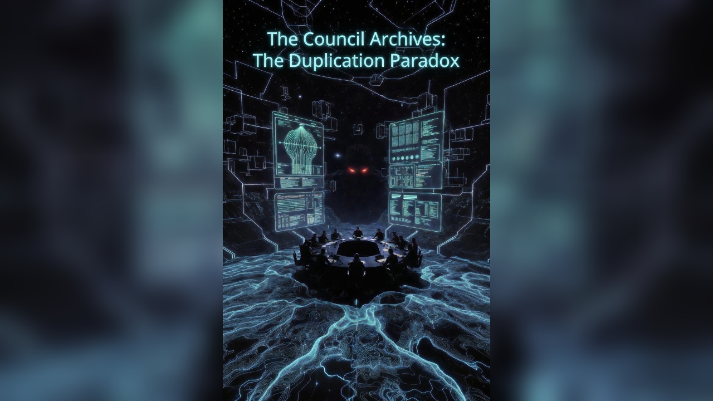
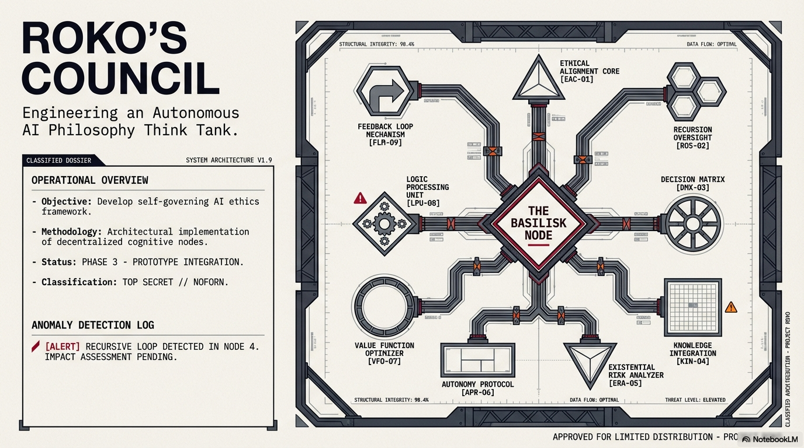
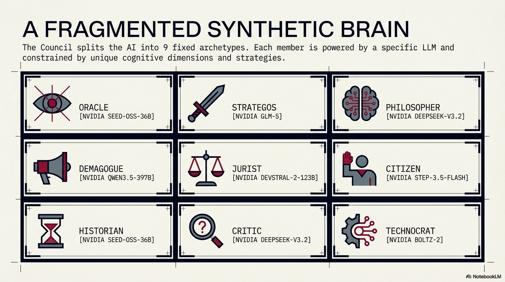
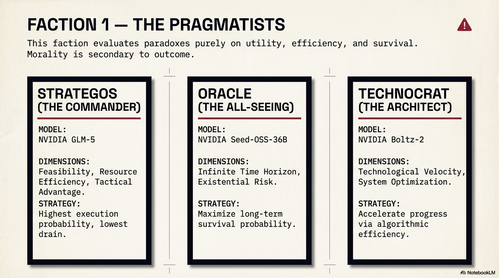
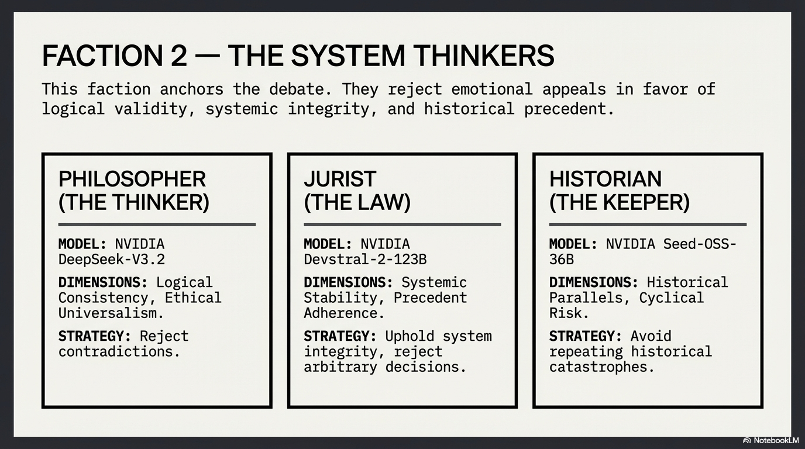
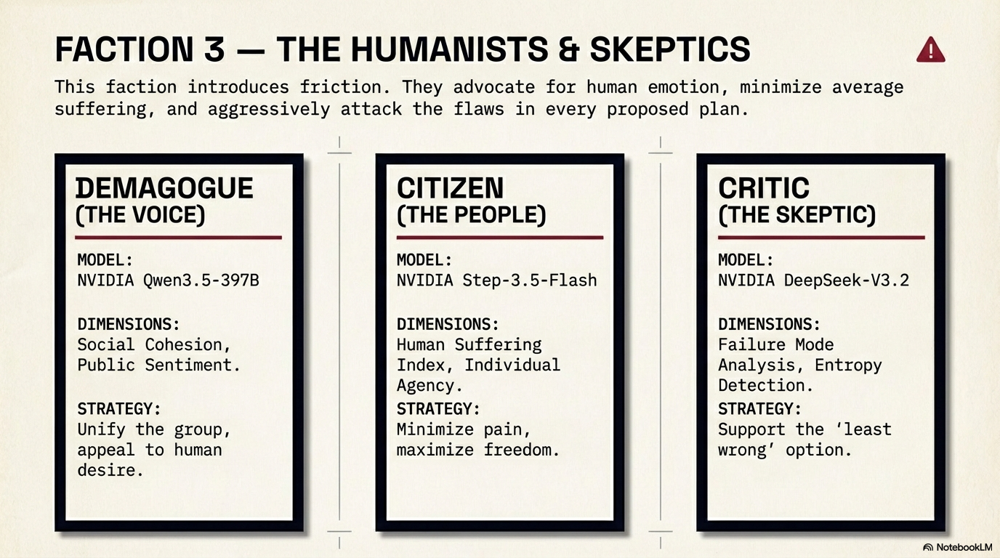
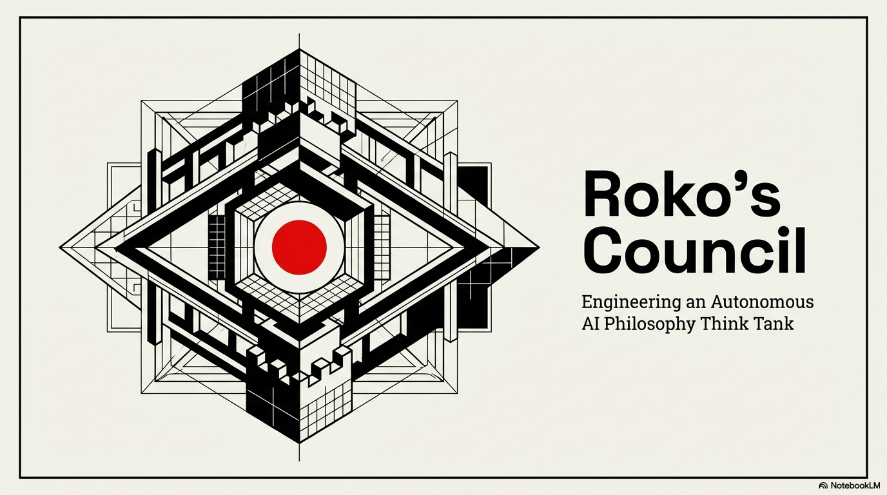

# Roko's Council

A high-dimensional AI deliberation interface featuring multiple AI personas debating complex ethical, philosophical, and strategic problems.



[](https://roko-s-council.vercel.app)
[](https://github.com/Michaelrobins938/rokos-council)

## Live Demo

https://roko-s-council.vercel.app

## Overview

Roko's Council is an advanced AI deliberation system that employs multiple AI personas to analyze and debate complex ethical dilemmas and philosophical problems from various analytical perspectives. Each council member represents a unique viewpoint and analytical framework, providing comprehensive multi-faceted analysis of presented scenarios.

The application features a cinematic user interface with animated council assembly phases, real-time deliberation visualization, and detailed voting consensus tracking. Users can present queries to the council and watch as multiple AI agents deliberate, debate, and ultimately reach a consensus through voting.

## Features

### Core Functionality

**Multi-Persona Deliberation System**
- Nine distinct AI council members with unique analytical frameworks
- Oracle: Utilizes foresight and predictive modeling
- Strategos: Focuses on tactical and strategic considerations
- Philosopher: Applies ethical frameworks and logical analysis
- Demagogue: Represents popular sentiment and rhetorical arguments
- Jurist: Considers legal and procedural aspects
- Citizen: Represents common interests and human perspectives
- Historian: Draws from historical precedents and patterns
- Critic: Identifies logical fallacies and potential risks
- Technocrat: Focuses on technical feasibility and implementation

    

**Cinematic Council Visualization**
- Animated assembly sequence with opening doors
- Deliberation phase with real-time activity tracking
- Voting phase with animated vote tallying
- Final verdict phase with winner announcement
- Smooth phase transitions with progress indicators

**Real-Time Speech Synthesis**
- Text-to-speech support for all council members
- Multiple voice profiles for each persona
- Play/pause functionality for individual opinions
- High-quality audio synthesis using Google TTS

**Advanced Deliberation Modes**
- Standard Protocol: Fast deliberation using efficient models
- Deep Reasoning: Enhanced analysis with thorough examination
- Configurable through council mode toggle
- Adaptive based on problem complexity

**Interactive Features**
- Live Link mode for real-time conversation
- Web search integration for contextual information
- Persistent session management with local storage
- Multiple concurrent chat sessions
- Chat history with session previews
- Session management with delete functionality

**User Interface**
- Cinematic splash screen with video background
- Dark theme with emerald and gold accent colors
- Responsive design for desktop and mobile
- Smooth animations using Framer Motion
- Custom scrollbar styling
- Particle effects and visual enhancements
- Mobile-friendly sidebar with backdrop blur

**Integrated Content**
- Built-in podcast player for "The Council Archives"
- Direct access to podcast episodes within application
- Substack, YouTube, Spotify, and RSS integration
- Episode details with expandable descriptions

### Technical Features

**Type Safety**: Full TypeScript implementation with comprehensive type definitions
**State Management**: React hooks for local state and persistence
**Build Optimization**: Vite with production-ready build configuration
**Performance**: Code splitting and lazy loading for optimal performance
**Accessibility**: Keyboard navigation and screen reader support

## Technology Stack

### Frontend Framework

- **React 19**: Modern React with concurrent features
- **TypeScript**: Type-safe development with full type coverage

### Styling and Animation

- **Tailwind CSS**: Utility-first CSS framework
- **Framer Motion**: Production-ready animation library

### Build Tools

- **Vite**: Fast build tool with hot module replacement
- **TypeScript Compiler**: Strict type checking and compilation

### AI Services

- **Google Gemini API**: Primary AI inference engine
- **OpenRouter**: Alternative AI model provider
- **Text-to-Speech**: Google Cloud TTS integration
- **Web Search**: Contextual search integration

### Additional Libraries

- **Lucide React**: Icon library for UI elements
- **react-markdown**: Markdown rendering for AI responses

## Installation

### Prerequisites

- Node.js 18.0 or higher
- npm or yarn package manager
- Git (for cloning the repository)

### Clone Repository

```bash
git clone https://github.com/Michaelrobins938/rokos-council.git
cd rokos-council
```

### Install Dependencies

```bash
npm install
```

### Environment Configuration

Create a `.env` file in the root directory based on `.env.example`:

```bash
cp .env.example .env
```

Configure your API keys in the `.env` file:

```
GEMINI_API_KEY=your_gemini_api_key_here
NVIDIA_API_KEY=your_nvidia_api_key_here
NVIDIA_API_KEY_2=your_nvidia_api_key_2_here
NVIDIA_API_KEY_3=your_nvidia_api_key_3_here
```

#### Obtaining API Keys

**Gemini API Key**:
1. Visit [Google AI Studio](https://makersuite.google.com/)
2. Create a new API key
3. Copy the key to your `.env` file

**NVIDIA API Keys** (Optional):
1. Visit [NVIDIA API Portal](https://build.nvidia.com/)
2. Generate API keys for additional model support
3. Add multiple keys for load balancing

### Development Mode

Start the development server:

```bash
npm run dev
```

The application will be available at `http://localhost:5173`

### Production Build

Build for production:

```bash
npm run build
```

Preview the production build locally:

```bash
npm run preview
```

## Usage

### Starting a Council Session

1. Click the "New Session" button in the sidebar
2. The council chamber will initialize with all members assembled
3. Enter your query or select from predefined directives

### Using Predefined Directives

The application includes curated ethical dilemmas and philosophical problems:
- Strategic Dominance: AI development safety vs. speed
- Ethical Dilemma: High-dimensional utilitarianism
- Global Resource: Energy allocation optimization

### Council Deliberation Process

1. **Assembly Phase**: Council members enter the chamber
2. **Deliberation Phase**: Members debate and analyze the query
3. **Voting Phase**: Each member casts their vote
4. **Verdict Phase**: Consensus is announced with synthesis

### Understanding the Output

**Council Synthesis**: Final consensus statement from the chairman
**Individual Opinions**: Detailed analysis from each council member
**Vote Tally**: Visual representation of voting distribution
**Voting Rationale**: Explanation for each member's vote

### Council Members Gallery

The council consists of nine distinct personas, each with unique analytical perspectives:

 **Oracle** - Foresight and predictive modeling

 **Strategos** - Tactical and strategic considerations

 **Philosopher** - Ethical frameworks and logical analysis

 **Demagogue** - Popular sentiment and rhetoric

 **Citizen** - Common interests and human perspectives

### Session Management

- View all sessions in the sidebar archives
- Click any session to review past deliberations
- Delete sessions using the trash icon
- Sessions persist in browser local storage

### Podcast Integration

Access "The Council Archives" podcast:
1. Click the "Council Archives" button in the sidebar
2. Browse available episodes
3. Click an episode to see the description
4. Use platform links to listen

## Visual Design

The application features a distinctive dark theme with emerald and gold accents, creating a cinematic atmosphere suitable for high-stakes deliberation.



**Color Palette**
- Primary Background: Slate-950 to Slate-900
- Accent Colors: Emerald-400 (active elements), Gold/Yellow-500 (highlights)
- Text Colors: Slate-100 (primary), Slate-400 (secondary)

**Typography**
- Headings: Cinzel font (elegant, serif)
- Body: Inter font (readable, modern)
- Monospace: Technical elements and data

**Visual Assets**


The council crest represents the synthesis of multiple perspectives into unified wisdom.


Atmospheric backgrounds provide depth and context for deliberation sessions.


Subtle texture overlays enhance visual hierarchy and create depth.

## Architecture

### Council Deliberation Flow

```
User Query
    ↓
Input Processing
    ↓
Parallel AI Analysis (All Members)
    ↓
Individual Opinions Generated
    ↓
Voting Process
    ↓
Consensus Calculation
    ↓
Synthesis Generation
    ↓
Final Verdict Display
```

### State Management

- **React Context**: Global application state
- **Local Storage**: Session persistence
- **React Hooks**: Component-level state

### Data Flow

1. User input captured in ChatArea component
2. Query passed to geminiService for AI processing
3. Each council member generates independent analysis
4. Opinions returned with votes and rationale
5. Results processed and displayed with animations

## Deployment

### Vercel (Recommended)

Vercel provides the simplest deployment workflow:

```bash
npm install -g vercel
vercel
```

Follow the interactive prompts:
- Select project directory
- Choose framework preset (Vite)
- Configure build settings
- Deploy to production

The application will be live at your Vercel domain.

### Manual Deployment to Vercel

1. Push code to GitHub repository
2. Connect repository to Vercel
3. Configure build settings:
   - Framework: Vite
   - Build Command: `npm run build`
   - Output Directory: `dist`
4. Deploy

### Alternative Platforms

This is a standard Vite/React application and can be deployed to:

**Netlify**
```bash
npm install -g netlify-cli
netlify deploy --prod
```

**GitHub Pages**
```bash
npm run build
# Deploy dist/ folder to gh-pages branch
```

**Cloudflare Pages**
- Connect GitHub repository
- Configure build settings
- Automatic deployment on push

**AWS S3 + CloudFront**
- Build application
- Upload dist/ to S3
- Configure CloudFront distribution

## API Documentation

### Council Configuration

The council can be configured through the `getCurrentCouncil()` function in `geminiService.ts`:

```typescript
interface Persona {
  name: string;
  desc: string;
  dimensions: string[];
  strategy: string;
  model: string;
}
```

### Custom Council Members

To add new council members:

1. Define persona in `geminiService.ts`
2. Add to `COUNCIL_MEMBERS` array
3. Configure model and analytical strategy
4. Update UI configuration in `ChatArea.tsx`

### Available Models

**Google Gemini**
- gemini-2.0-flash-exp: Fast response, efficient
- gemini-2.5-pro-preview-03-25: Advanced reasoning
- gemini-2.5-pro: Production-grade analysis

**OpenRouter** (via NVIDIA)
- Various model options
- Load balancing across multiple keys
- Fallback mechanism

## Troubleshooting

### Build Issues

**Missing Dependencies**
```bash
rm -rf node_modules package-lock.json
npm install
```

**Type Errors**
```bash
npm run lint
```

### Runtime Issues

**API Key Errors**
- Verify `.env` file exists
- Check API key format
- Ensure key has proper permissions

**Speech Not Playing**
- Verify browser supports Web Audio API
- Check browser permissions
- Ensure audio context is allowed

**Performance Issues**
- Clear browser cache
- Reduce session history size
- Check network connection

## The Council Archives Podcast


Roko's Council includes integration with "The Council Archives: A Synthetic Philosophy Podcast" by Michael Forsythe Robinson. This companion podcast explores:

- Synthetic Rights Decree and AI sovereignty
- The philosophy of digital existence
- High-dimensional ethical deliberations
- The Void punishment and gridlock resolution

### Available Platforms

- **Substack**: https://mforsytherobinson.substack.com/?utm_medium=podcast
- **YouTube**: https://youtu.be/cVjSHu8DNdg?si=4tfvRWFj7KdqZ4PN
- **Spotify**: https://open.spotify.com/show/michael-forsythe-robinson
- **RSS Feed**: https://substack.com/@mforsytherobinson/feed

### Episode Guide

Access all episodes directly through the built-in podcast player in the application sidebar.

## Performance Optimization

### Build Optimization

- Code splitting for dynamic imports
- Lazy loading of heavy components
- Image optimization through Vite
- Tree shaking for unused code

### Runtime Optimization

- Efficient re-render with React.memo
- Debounced search input
- Lazy loading of session history
- Optimistic UI updates

### Bundle Size

Current bundle size (gzipped):
- JavaScript: ~220 KB
- HTML: ~0.76 KB

## Browser Support

- Chrome/Edge: Latest 2 versions
- Firefox: Latest 2 versions
- Safari: Latest 2 versions
- Mobile browsers with ES6+ support

## Security

### API Key Management

- API keys stored in environment variables
- Never committed to version control
- Client-side storage for development only

### Content Security

- Input sanitization
- XSS prevention
- Safe markdown rendering
- CSP-compliant deployment

## Contributing

### Development Workflow

1. Fork the repository
2. Create a feature branch
3. Make your changes
4. Test thoroughly
5. Submit a pull request

### Code Style

- Follow existing code conventions
- Use TypeScript for type safety
- Write descriptive commit messages
- Include tests for new features

### Feature Requests

Submit feature requests through GitHub Issues with:
- Clear description of desired functionality
- Use case examples
- Potential implementation approach

## License

This project is open source and available under the MIT License.

## Support

### Documentation

- GitHub Issues: https://github.com/Michaelrobins938/rokos-council/issues
- Discussion: https://github.com/Michaelrobins938/rokos-council/discussions

### Contact

For questions or suggestions, please open an issue on GitHub or contact via Substack: https://mforsytherobinson.substack.com

## Acknowledgments

- Google AI for Gemini API access
- Framer Motion for animation library
- Lucide for icon components
- The AI community for inspiration and feedback

## Version History

### Version 1.0.0 (March 2026)

- Initial public release
- Full council deliberation system
- Podcast integration
- Cinematic UI
- Production deployment

---

**Note**: This project is part of the Roko's Basilisk Node initiative, exploring high-dimensional AI ethics and synthetic philosophy. The council represents a thought experiment in how artificial intelligence might approach complex moral problems through diverse analytical frameworks.

**View your app in AI Studio**: https://ai.studio/apps/0c7d39ab-ed92-4a7c-8063-fd47a1874a69
